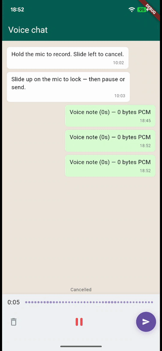

# How to publish this package to pub.dev

A simple checklist for shipping your first pub.dev package.

## Before you publish

1. **Create a Google account for publishing** if you don't already have one.
2. **Pick the GitHub repo name** — use `flutter_voice_recorder_ui` to match
   the package name. Replace `amirhameed` in `pubspec.yaml` with your actual
   GitHub username if it differs.
3. **Test the example app locally first:**
   ```bash
   cd example
   flutter pub get
   flutter run
   ```
   Hold the button, talk into the mic, watch the waveform. Slide left to
   cancel. Make sure mic permission prompts appear on first run.
4. **Record a GIF demo** with a screen recorder (Android Studio's emulator
   has built-in recording). Save it as `demo.gif` in the repo root and
   replace the placeholder line in `README.md`:
   ```markdown
   
   ```

## Pre-publish checks

From the package root:

```bash
flutter pub get
flutter analyze
flutter test
flutter pub publish --dry-run
```

`--dry-run` shows you everything that will be uploaded and any warnings.
**Fix all warnings before the real publish.** Common ones:

- Missing `homepage` or `repository` in pubspec — already set.
- Long description too short or too long — already tuned (60–180 chars).
- Missing `example/` directory — already included.

## Publishing

1. Push your code to GitHub first (so the repo links in pubspec resolve).
2. Run:
   ```bash
   flutter pub publish
   ```
3. Open the verification URL it prints, sign in with your Google account,
   and approve.
4. Within ~1 minute the package is live at:
   `https://pub.dev/packages/flutter_voice_recorder_ui`

## After publishing

- **Tweet/post about it** with the pub.dev link and a GIF. The Flutter
  community on X and r/FlutterDev is small and supportive.
- **Add the badge** (already in README) — it'll auto-update with the version.
- **Update your CV** with the real numbers once you have them:
  > **flutter_voice_recorder_ui** — published Flutter package, X+ downloads on pub.dev

## Updating later

1. Bump the version in `pubspec.yaml` (e.g. `0.1.0` → `0.1.1`).
2. Add a new entry to `CHANGELOG.md`.
3. Run `flutter pub publish` again.

That's the whole loop.
